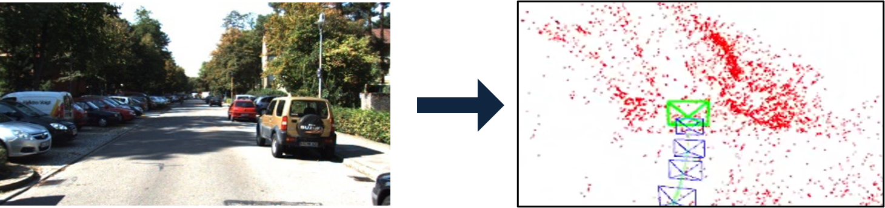
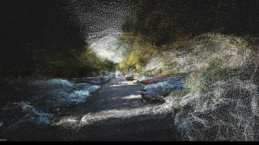

# ORB_SLAM2_with_PCL
This is a modified ORB_SLAM2 (from  https://github.com/raulmur/ORB_SLAM2) with a visualization module.
I only add the visualization module to ORB SLAM2 (from https://github.com/gaoxiang12/ORBSLAM2_with_pointcloud_map) with the effort not to change the original code. 

# Run
This repository exists for only show the source code.
If you want to run this module, please use the docker image (https://hub.docker.com/repository/docker/lrrghdrh/pure_orb_slam2_with_pcl).

This code include the function that save the map point (`SaveMapPointsKITTI`).
If you want to use this fuction, copy and paste the `System.h` and `System.cc` files into each file in the docker image.

